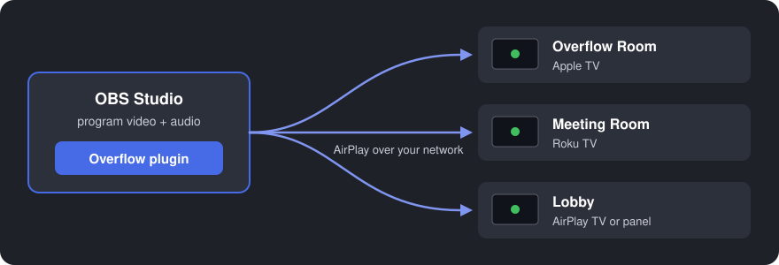
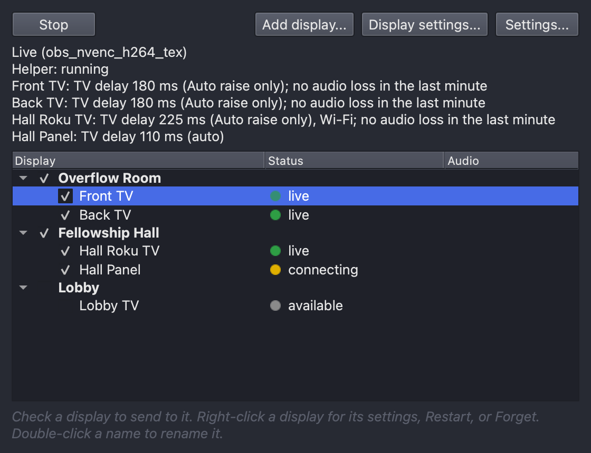
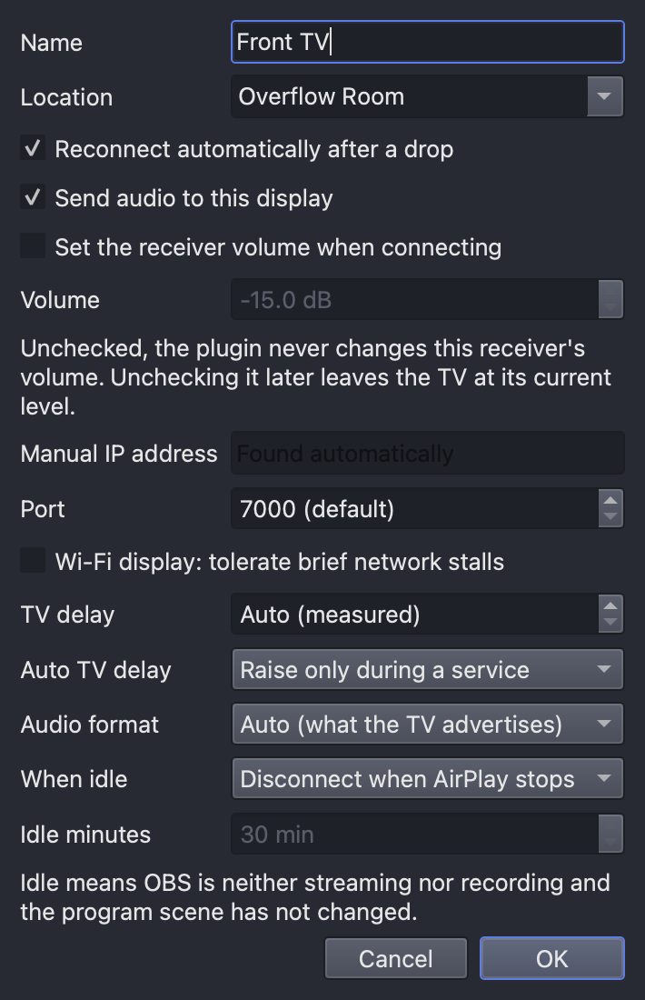
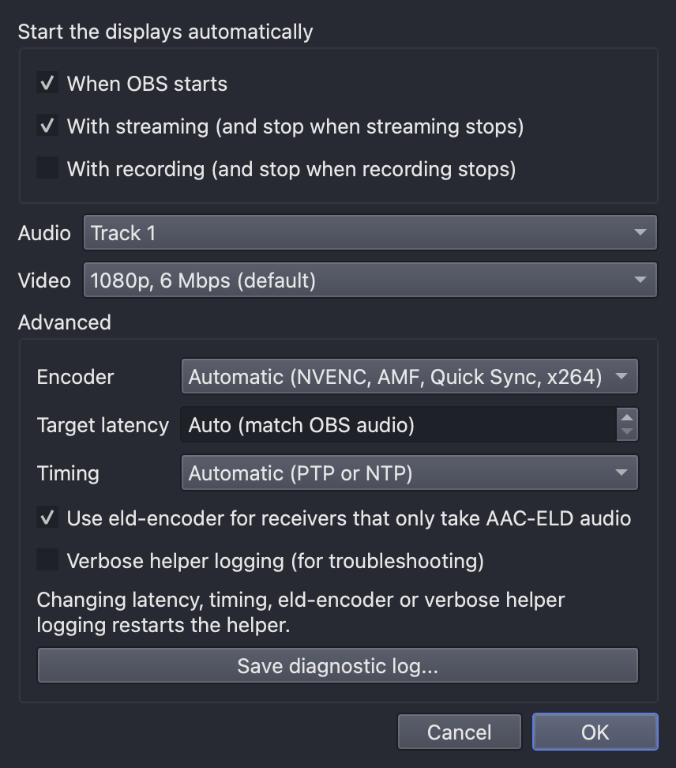

# Overflow

**Send your OBS program output to the TVs in other rooms, several at once, over AirPlay.**



Overflow is an OBS Studio plugin for overflow rooms, lobbies, cry rooms, fellowship halls, and any
other place that needs to see and hear what's happening in the main room. It encodes the OBS program
(video and audio) once and plays it on Apple TVs, Roku TVs and other AirPlay receivers, all at the
same time. You need no capture cards, HDMI runs or second computer, and your live stream and
recording are not affected.

It was built for a venue that streams with OBS and needs the same picture and sound on TVs in
several other rooms.

## Screenshots

<p>
  
</p>

The Overflow dock: displays grouped by room, a status light for each, and each live display's TV
delay and audio health. (Sample rooms.)

<p>
  
  
</p>

Per-display settings, and the plugin's settings.

## Features

- **Many rooms at once.** Check the displays you want and press Start. Group displays by location
  and switch a whole room on or off with one checkbox.
- **Apple TV and Roku.** AirPlay 2 with pairing (the on-screen code is asked for once and
  remembered), plus legacy AirPlay receivers.
- **Lip sync per room.** Each display has its own TV delay. In Auto mode the plugin raises the delay
  when late video, late audio or network loss repeats.
- **Its own encoder.** A dedicated H.264 encoder (NVENC, then AMD AMF, then Intel Quick Sync, then
  x264), separate from your stream and recording settings.
- **Hands-off operation.** Start automatically with OBS, with streaming or with recording.
  Reconnects on its own when a TV or the network drops out, and has a per-display restart for a TV
  woken from standby.
- **Crash isolation.** AirPlay runs in a separate helper process. If it fails, OBS keeps running and
  the plugin restarts the helper.
- **Network friendly.** Media is DSCP-marked (EF for audio, AF41 for video) so switches and Wi-Fi
  access points can prioritize it, and Wi-Fi-tolerant buffering can be turned on per display.

## Supported receivers

| Receiver | Status |
|---|---|
| Apple TV HD (AirPlay 2) | Tested |
| Apple TV 4K (3rd generation; AAC-ELD audio) | Tested (from macOS) |
| Roku TVs with AirPlay (tested: Hisense Roku TV) | Tested |
| UxPlay-based receivers, including interactive panels with an AirPlay receiver app | Tested |
| Other AirPlay 2 TVs (Samsung, LG, Vizio, Sony) | Untested; reports welcome |

Some receivers accept only AAC-ELD audio; Overflow includes an AAC-ELD encoder for them.
[Report how your receiver behaves](../../issues/new?template=receiver_report.yml).

## Requirements

- OBS Studio 32.x on one of:
  - Windows 10 or 11, 64-bit.
  - macOS 13 or later, Apple silicon or Intel.
  - Linux x86_64 (built on Ubuntu 24.04 against OBS from the OBS PPA; tests pass and it loads in
    OBS; one receiver session delivered picture and sound, on a low-power host with a reduced
    frame rate).
- The computer and the receivers on the same network, or receivers added by IP address.

The Windows build is in production use. The macOS and Linux builds are newer;
[`plugin/README.md`](plugin/README.md) says what has been tested on each.

## Install

Download the file for your system from [Releases](../../releases), close OBS, then:

- **Windows:** extract `obs-overflow-<version>-windows-x64.zip` into
  `%ProgramData%\obs-studio\plugins\` (normally `C:\ProgramData\obs-studio\plugins\`), so that
  `...\plugins\obs-overflow\bin\64bit\obs-overflow.dll` exists. Portable OBS uses a different
  folder; see [`plugin/README.md`](plugin/README.md#windows).
- **macOS:** open `obs-overflow-<version>-macos-universal.pkg`. It is not notarized, so macOS
  blocks it the first time: open **System Settings > Privacy & Security** and click **Open Anyway**.
- **Linux:** extract `obs-overflow-<version>-linux-x86_64.tar.gz` into
  `~/.config/obs-studio/plugins/` (for the OBS Flatpak,
  `~/.var/app/com.obsproject.Studio/config/obs-studio/plugins/`).

Start OBS and open **Docks > Overflow**. Full instructions, upgrade steps and troubleshooting are in
[`plugin/README.md`](plugin/README.md).

## How it works

```
OBS program ──► obs-overflow (OBS plugin) ──pipes──► overflow-helper ──AirPlay──► Apple TV
                 dock, settings, H.264 encoder         one session per display   ──► Roku TV
                                                                                  ──► ...
```

The plugin (C++) encodes the program and supervises `overflow-helper` (Go), which runs one AirPlay
session per display. The two talk over the helper's stdin and stdout; see
[`docs/protocol.md`](docs/protocol.md).

## Repository layout

- `plugin/`: the OBS plugin, `obs-overflow`. Its logic lives in `plugin/core/` and builds and
  tests without OBS.
- `helper/`: `overflow-helper`, built from a fork of
  [omarroth/doubletake](https://github.com/omarroth/doubletake) (LGPL-3.0), vendored as a git
  subtree. Pull upstream fixes with
  `git subtree pull --prefix=helper https://github.com/omarroth/doubletake.git main --squash`.
- `eld-encoder/`: the AAC-ELD audio encoder for receivers that need it.
- `docs/protocol.md`: the wire protocol between the plugin and the helper.

## Contributing

Bug reports, receiver compatibility reports and pull requests are welcome. See
[CONTRIBUTING.md](CONTRIBUTING.md). Report security issues privately, as described in
[SECURITY.md](SECURITY.md).

## Use of AI tools

Most of Overflow's own code, tests and documentation were written with Claude Code, Anthropic's AI
coding tool, working from my requirements and design decisions. Automated tests cover the plugin
logic and the helper, and the Windows builds in production use were tested on real receivers. The
AirPlay sender it builds on, doubletake, is a separate upstream project and isn't covered by this
note. Please judge the code on its merits, and report problems through the issue forms.

## License and credits

GPLv3 (see `LICENSE`). Code under `helper/` is LGPL-3.0 (see `helper/LICENSE`). `eld-encoder` links
the Fraunhofer FDK AAC library and ships under its license (see `eld-encoder/LICENSE-NOTICE.md`).

The AirPlay sender is built on [doubletake](https://github.com/omarroth/doubletake) by Omar Roth.

AirPlay, Apple TV and Apple are trademarks of Apple Inc. Roku is a trademark of Roku, Inc. Overflow
is not affiliated with or endorsed by either company.
